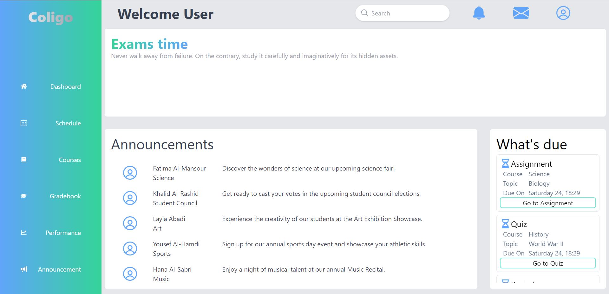

# AnywareDashboard - An educational dashboard

## Description

Anyware is a web applicationthat aims to facilitate the communication through educational clusters by offering multiple functionalities
like showing announcements, showing students their deadline and their quizzes grades.

## Features

- **Add Announcements:** Teachers and staff can add announcements for students to view.

- **Publish grades:** Teachers can publish students grades

- **Show deadlines:** The application help students monitor their deadlines and upcomming quizzes

## Demo screenshot

## Technologies

AnywareDashboard was built using the following technologies and frameworks:

- **React.js:** Used to create a dynamic and responsive user interface.

- **Redux:** Used for state management.

- **JavaScript (ES6+):** The primary programming language used for the backend.

- **MongoDB:** Used for the database.

- **TypeScript:** The primary programming language used for the front end.

- **HTML/CSS:** Used for structuring the webpage and styling the components.

- **Tailwind:** Used for styling.

- **npm:** Package managers to install and manage project dependencies.

_Thank you for checking out the AnywareDashboard project! If you have any questions or feedback, feel free to contact me at abdelrahman.abdelaziz9@gmail.com.

